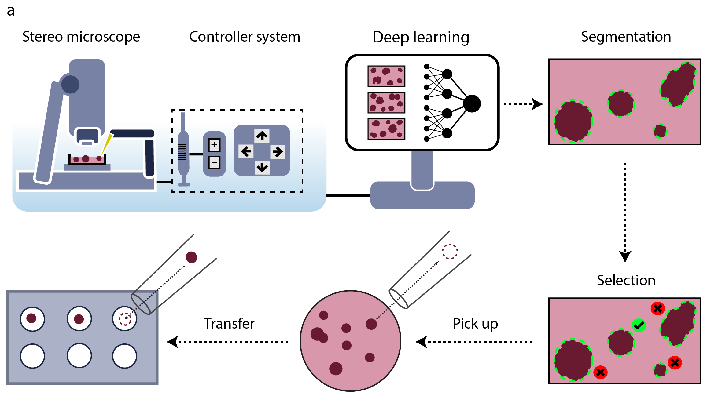
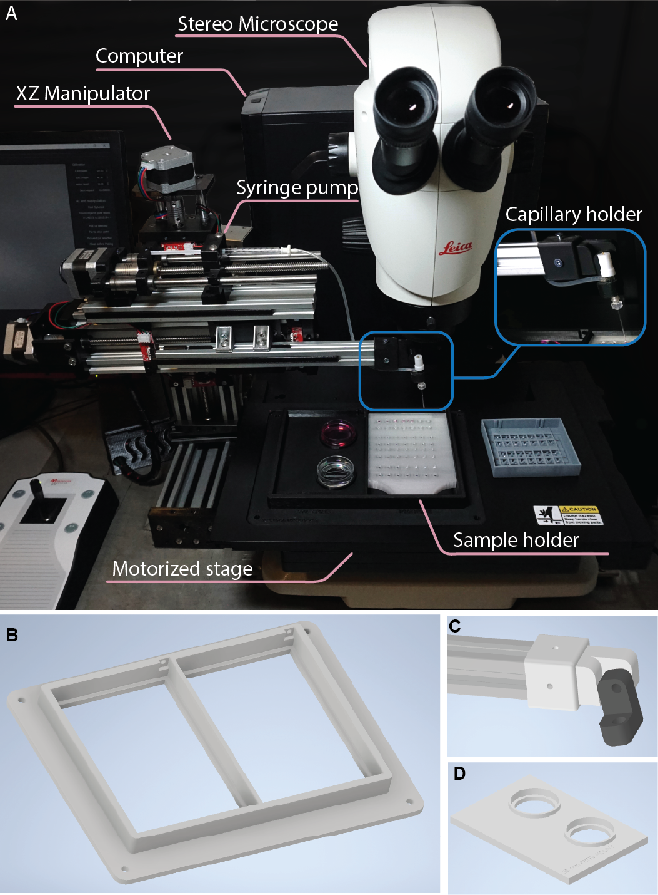

# SpheroidPicker  

This repository designed to reproduce the SpheroidPicker system, providing tools and resources for both hardware handling and image analysis. 

### Schematics  

  
The system includes a stereo microscope, syringe, stage, and manipulator controller. The automatic screening function results in brightfield images of the spheroids. The segmentation and feature extraction steps are based on a deep learning model. After the selection of the spheroids, the spheroid picker automatically transfers the spheroids into the target plate.

## Repository Structure  

1. **`AutomaticSpheroidPickerSoftware`**  
   Contains C++ software for interfacing with and managing the specific hardware components used in the SpheroidPicker system.  

2. **`SpheroidPicker-Image-analysis`**  
   Includes a Docker environment to train and reproduce the results presented in the publication.  

## System Overview  

### Real Illustration  
  


## Citation  

If you use this repository, please cite the following publication:  


```bibtex
@article{grexa2021spheroidpicker,  
  title={SpheroidPicker for automated 3D cell culture manipulation using deep learning},  
  author={Grexa, I. and Diosdi, A. and Harmati, M. and others},  
  journal={Scientific Reports},  
  volume={11},  
  pages={14813},  
  year={2021},  
  publisher={Nature Publishing Group},  
  doi={10.1038/s41598-021-94217-1}  
}


@phdthesis{grexa2024development,
  title={Development of intelligent microscopy systems},
  author={Grexa, Istv{\'a}n}
}